# TaxProExchange Database ERD

This document contains the Entity Relationship Diagram (ERD) for the TaxProExchange database schema.

## Database Schema Overview

The TaxProExchange database is built on Supabase PostgreSQL and includes the following main entities:

- **User Management**: Users, Profiles, Licenses
- **Professional Data**: Specializations, Locations, Profile relationships
- **Job Board**: Jobs, Applications, Reviews, Milestones
- **Messaging**: Connections for professional networking
- **Preferences**: Email preferences, Saved searches, Notification settings
- **Audit**: Audit trail for system activities

## ERD Diagram

## Core Database Schema

## Job Board & Reviews System

```mermaid
erDiagram
    jobs {
        uuid id PK
        text created_by
        text title
        text description
        text status
        date deadline_date
        text payout_type
        numeric payout_fixed
        numeric payout_min
        numeric payout_max
        jsonb sla
        text[] credentials_required
        text[] specialization_keys
        boolean remote_ok
        uuid assigned_profile_id FK
        text sla_version
        jsonb sla_overrides
        boolean has_escrow
        text fulfillment_mode
        timestamptz created_at
    }

    job_applications {
        uuid id PK
        uuid job_id FK
        uuid applicant_profile_id FK
        text applicant_user_id
        text cover_note
        numeric proposed_rate
        text proposed_payout_type
        text status
        timestamptz created_at
    }

    jobs_milestones {
        uuid id PK
        uuid job_id FK
        text name
        int due_offset_days
        int release_percent
        timestamptz created_at
    }

    reviews_firm_by_preparer {
        uuid id PK
        uuid job_id FK
        text reviewer_user_id
        text reviewee_user_id
        jsonb ratings
        text comment
        timestamptz created_at
    }

    reviews_preparer_by_firm {
        uuid id PK
        uuid job_id FK
        text reviewer_user_id
        uuid reviewee_profile_id FK
        jsonb ratings
        text comment
        timestamptz created_at
    }

    profiles {
        uuid id PK
        text first_name
        text last_name
        text firm_name
        text visibility_state
    }

    %% Job Board Relationships
    jobs ||--o{ job_applications : "receives"
    jobs ||--o{ jobs_milestones : "has"
    jobs ||--o{ reviews_firm_by_preparer : "generates"
    jobs ||--o{ reviews_preparer_by_firm : "generates"
    profiles ||--o{ job_applications : "applies_to"
    profiles ||--o{ reviews_preparer_by_firm : "receives"
```

## User Preferences & Audit System

## Key Relationships

### User & Profile Management
- **users** → **profiles**: One-to-one relationship (each user has one profile)
- **profiles** → **licenses**: One-to-many (profiles can have multiple licenses)
- **profiles** → **profile_specializations**: Many-to-many through junction table
- **profiles** → **profile_locations**: Many-to-many through junction table

### Job Board System
- **profiles** → **jobs**: One-to-many (firms create jobs)
- **jobs** → **job_applications**: One-to-many (jobs receive applications)
- **profiles** → **job_applications**: One-to-many (professionals apply to jobs)
- **jobs** → **jobs_milestones**: One-to-many (jobs have payment milestones)

### Review System
- **jobs** → **reviews_firm_by_preparer**: One-to-many (jobs generate firm reviews)
- **jobs** → **reviews_preparer_by_firm**: One-to-many (jobs generate preparer reviews)

### Messaging & Networking
- **profiles** → **connections**: Many-to-many (profiles can connect with each other)

### Preferences & Notifications
- **users** → **notification_prefs**: One-to-one (users configure notification preferences)
- **users** → **pros_saved_searches**: One-to-many (users can save multiple searches)

## Database Features

### Row Level Security (RLS)
All tables have RLS enabled with appropriate policies for:
- Public read access for verified profiles
- User-specific access for personal data
- Job owner access for job management
- Application access for relevant parties

### Indexes
Comprehensive indexing strategy including:
- Full-text search indexes on profiles
- GIN indexes for array fields
- Performance indexes on frequently queried columns

### Audit Trail
- **audits** table tracks all significant system activities
- Includes actor, entity, action, and metadata

### Extensions
- `uuid-ossp` for UUID generation
- `pg_trgm` for trigram-based text search

## Notes

- The database uses UUIDs as primary keys for better distributed system compatibility
- JSONB fields are used for flexible data structures (SLA templates, ratings, preferences)
- Array fields are used for multi-value attributes (specializations, locations, credentials)
- Timestamps are consistently used for audit trails and temporal queries
- The schema supports both individual professionals and firms through the profiles table
